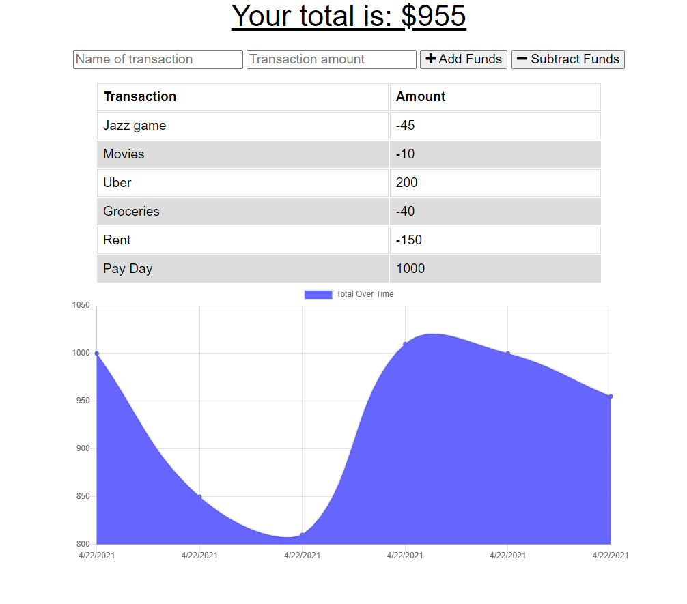

  # Budget Tracker 

  
  ## Description
  A budgeting app for a person that travels a lot and may lost connectivity to the internet. A service worker and indexeddb database are used to allow the user to continue to log transactions and then have them added to the server database once back online. 

  [Project Link](https://desolate-escarpment-73377.herokuapp.com/)

  

  ## Table of Contents

  * [Installation](#installation)
  * [Usage](#usage)
  * [License](#license)
  * [Contributing](#contributing)
  * [Tests](#tests)
  * [Questions](#questions)

  ## Installation

  npm i

  ## Usage

  To run the app for development run "node server.js"

  ## License

  This project is licensed under the MIT license.

  ## Contributing
  Nothing at this time

  ## Tests

  To run tests, run the following command: 

  npm test

  ## Questions
  If you have any questions please email me at jasoncjorgensen@gmail.com.

  Also, please see my [GitHub](https://github.com/Jason-Jorgensen)
